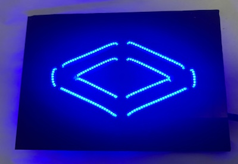
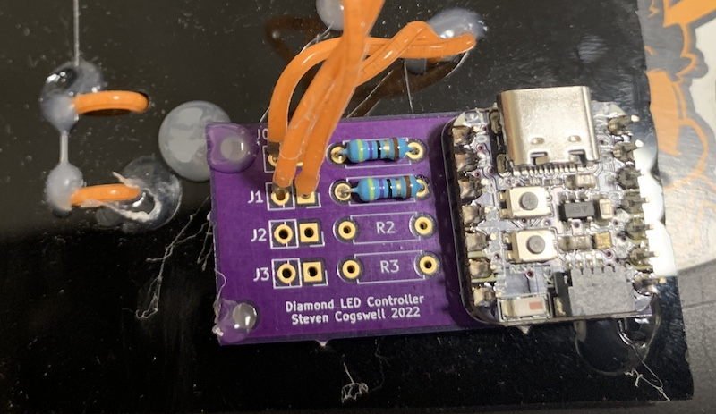
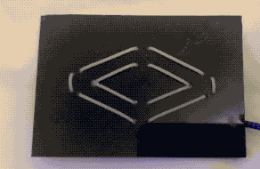

# Diamond Twitch LED Controller

This project uses Circuitpython on an Adafruit QT PY ESP32S2 and the Adafruit "noods" LED strands to make an animated Diamond Club symbol that animates when your favourite twitch streamer goes live.  It has an initial ramping animation when they first go live leading to a steady state pulse heartbeat for the duration of their live stream, and then ramps down to off when they go offline. 

QTPY: https://www.adafruit.com/product/5325

Blue LED strands: https://www.adafruit.com/product/5508

You can optionally hook an Adafruit 128x64 OLED featherwing via stemma-qt and it will show debug messages (not required, the code auto-detects if the OLED is present)
https://www.adafruit.com/product/4650

The QTPY neopixel shows network status.  You can also receive debug messages via the USB port serial connection.  The board reboots on a schedule to keep things like ticks timers from running too long and tokens from expiring.  Most runtime errors will just trigger a reboot so if it constnatly reboots check the debug output and your settings in `secrets.py`

The pictures show a custom PCB I made to hold the current limiting resistors for the LED strands but you can just inline the resistor from the ESP32S2 pad if you're so inclined. 

The framerate on this gif is too low to show the majesty of this opening animation but oh well 

Because twitch is twitch you need to generate Twitch oAuth credentials as described in `secrets.py`

